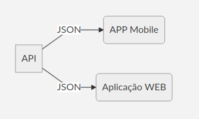

<h1 align="center">
	
</h1>

## DevRadar - Semana OmniStack 10.0

DevRadar foi o projeto desenvolvido na <b>semana OmniStack 10 realizado pela [Rockeseat](https://rocketseat.com.br/)</b>, o projeto tem como intuito criar uma API para servir uma aplicação web e uma aplicação mobile sendo assim a aplicação web para cadastrar os devs e a aplicação mobile para realizar a visualização dos devs no mapa e poder realizar buscas de acordo com a tecnologia.

<h1 align="center">
	
</h1>

> Preview Web

> Preview do Mobile

# Instruções para utilização  :hammer:
	
## Clonar o repositório :octocat:

 Você precisa clonar o repositório e pode fazer isso digitando em seu terminal `$ git clone https://github.com/Luuck4s/DevRadar.git`.
 
## API :satellite:

 Logo após clonar o repositório navegue ate a pasta backend `cd backed/` e execute o comando `yarn install` ou `npm install`.

Você vai precisar criar uma conta no [Mongo Atlas](https://www.mongodb.com/cloud/atlas) e criar um cluster e logo após pegar sua string de conexão e colocar dentro do arquivo `example.env` dentro da pasta backend, nele deve conter `MONGO=sua string de conexão com Mongo Atlas`, após colocar sua string de conexão renomeie o arquivo para apenas `.env`. 

Logo após seguir tudo que foi feito acima pode executar o comando `yarn dev` ou `npm run dev` e o então deverá aparecer no console `[SERVER] server runing in port 3333`. 

## Web :computer:

Após seguir os passos acima e o backend está funcionando vá para pasta `web` e execute `yarn install` ou `npm install`.

Depois das dependências terminarem de instalar execute o comando `yarn start` ou `npm run start`.

## Mobile :iphone:

Para executar o mobile entre na pasta do mobile logo após o backend estar funcionando e execute `yarn install` ou `npm install`.

Após as dependências terminarem de baixar execute `yarn start` ou `npm start` e ai o expo já estará funcionando para você ler o Qr Code e utilizar a aplicação.

## Tecnologias Utilizadas :mag:

<b>API</b>
- [NodeJs;](https://nodejs.org/en/)
- [Express;](https://www.express.com/)
- [Axios;](https://github.com/axios/axios)
- [Socket-io.](https://socket.io/)

> Para realizar os teste de endpoints foi utilizado o [Insomnia](https://insomnia.rest/)

<b>Web</b>
- [React Js;](https://pt-br.reactjs.org/)
- [Axios.](https://github.com/axios/axios)

<b>Mobile</b>
- [React Native;](https://facebook.github.io/react-native/)
- [Expo;](https://expo.io/)
- [Axios;](https://github.com/axios/axios)
- [Socket-io.](https://socket.io/)
