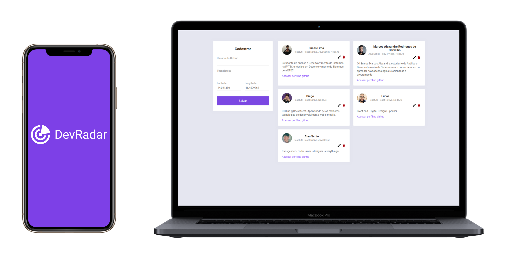
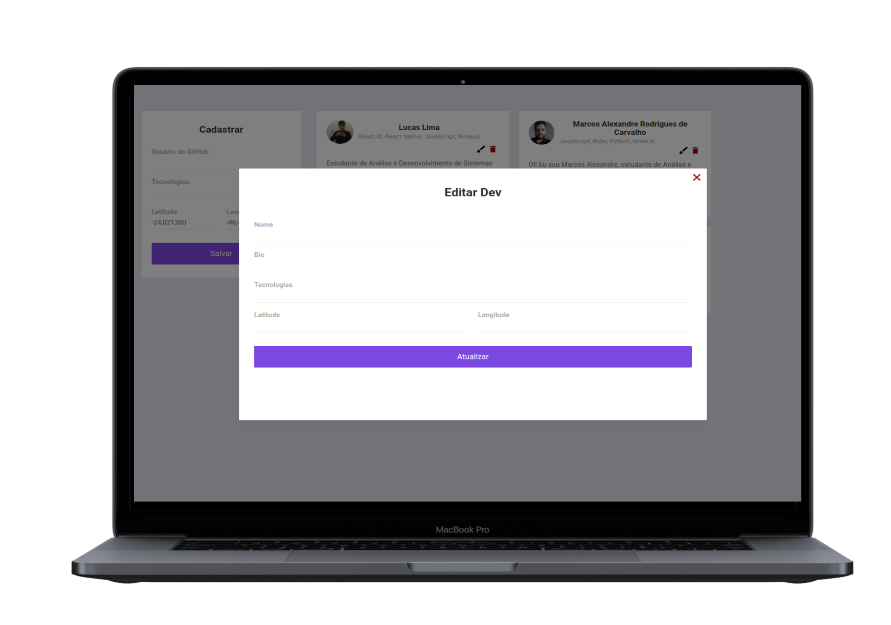
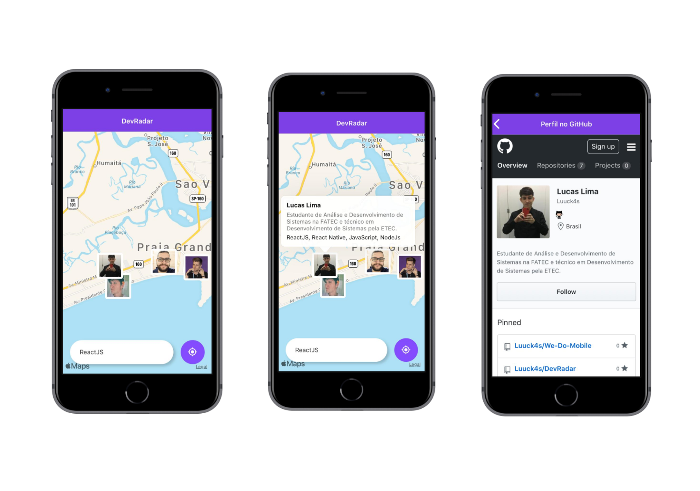

<h1  align="center">

</h1>

  

<h4  align="center">
🚀 Semana OmniStack 10.0
</h4>

  

<a  href="#telescope-projeto">🔭 Projeto</a>&nbsp;&nbsp;&nbsp;|&nbsp;&nbsp;&nbsp
<a  href="#computer-tecnologias"> 💻 Tecnologias</a>&nbsp;&nbsp;&nbsp;|&nbsp;&nbsp;&nbsp;
<a  href="#-preview">💜 Preview</a>&nbsp;&nbsp;&nbsp;|&nbsp;&nbsp;&nbsp;
<a  href="#-getting-started">🤠 Getting Started </a>

  

## :telescope: Projeto
 
**DevRadar** foi o projeto desenvolvido na semana **OmniStack 10** realizado pela [Rockeseat](https://rocketseat.com.br/), o projeto tem como intuito criar uma API para servir uma aplicação web e uma aplicação mobile sendo assim a aplicação web para cadastrar os devs e a aplicação mobile para realizar a visualização dos devs no mapa e poder realizar buscas de acordo com a tecnologia.

  

## :computer: Tecnologias

  

**:satellite: Backend**

 
- [NodeJs;](https://nodejs.org/en/)

- [Express;](https://www.express.com/)

- [Axios;](https://github.com/axios/axios)

- [Socket-io.](https://socket.io/)

  

**:computer: Frontend**

- [React Js;](https://pt-br.reactjs.org/)

- [Axios.](https://github.com/axios/axios)
 

**:iphone: Mobile**
 
- [React Native;](https://facebook.github.io/react-native/)

- [Expo;](https://expo.io/)

- [Axios;](https://github.com/axios/axios)

- [Socket-io.](https://socket.io/)

  

## 💜 Preview
 

 

## 🤠 Getting Started

Você precisa clonar o repositório e pode fazer isso digitando em seu terminal `$ git clone https://github.com/Luuck4s/DevRadar.git`.
 

### :satellite: Backend

Logo após clonar o repositório navegue ate a pasta backend `$ cd backed/` e execute o comando `$ yarn install` ou `$ npm install`.

Você vai precisar criar uma conta no [Mongo Atlas](https://www.mongodb.com/cloud/atlas) e criar um cluster e logo após pegar sua string de conexão e colocar dentro do arquivo `example.env` dentro da pasta backend, nele deve conter `MONGO=sua string de conexão com Mongo Atlas`, após colocar sua string de conexão renomeie o arquivo para apenas `.env`.

 
Logo após seguir tudo que foi feito acima pode executar o comando `$ yarn dev` ou `$ npm run dev` e o então deverá aparecer no console `[SERVER] server runing in port 3333`.

> O fronted e o mobile necessita do backend funcionando para ter seu funcionamento normal!

### :computer: Frontend
  

Após seguir os passos acima e o backend está funcionando vá para pasta `$ cd web/` e execute `$ yarn install` ou `$ npm install`.

Depois das dependências terminarem de instalar execute o comando `$ yarn start` ou `$ npm run start`.

### :iphone: Mobile
  
Para executar o mobile entre na pasta do `$ cd mobile/`  logo após o backend estar funcionando e execute `$ yarn install` ou `$ npm install`.

 Após as dependências terminarem de baixar execute `yarn start` ou `npm start` e ai o expo já estará funcionando para você ler o Qr Code e utilizar a aplicação.

--- 

<h5 align="center"> 🚀 Semana OmniStack 10.0 by Luuck4s 💜 </h5>

---
